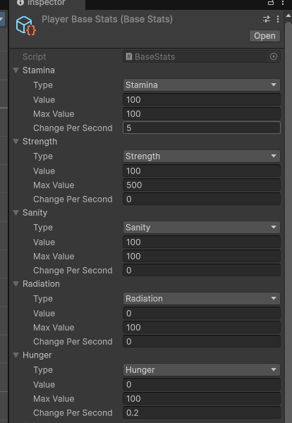
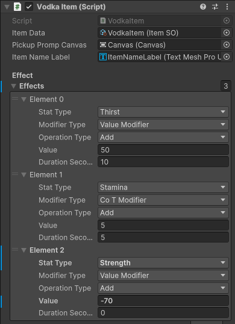

# PlayerStatsSystem
Small project desmostrating a small scale customisable player stat system.
It started off as a small project but I got too caught up in adding improvements to the stats system haha.
Click on this image to watch a quick demostration:
[](https://www.youtube.com/watch?v=h3DXxTCytgk)

# Details
## How does this work?
Well each entity has it's own stats, the base stats is a ScriptableObject with a list of stats this entity will have. Each stat has a type (strength, stamina etc), maxValue, startingValue and changePerSecond.
This last one is a passive change of the stat, can be negative if the stat should decrease by default or positive for the opposite effect. It can be 0 to not do anything.

<p align="center">
  
</p>

Now the system works by simply applying modifiers that change how those values are represented. It can be a temporary modifier or a constant one, but at the core it simply just outputs a 
value after each modifier has applied it's effect.

## Stat Modifier
The Stat Modifier is a class which holds information about which stat it affects, for how long, and how. It has an abstract function "Handle", which is called by the Stats Mediator class.
You can create your own modifiers from this class, in the project there is only one called BasicStatModifier, which supports add/multiply operations on a given stat.
Now each stat modifier can apply 4 different effects:
- Apply a ValueModifier for X amount of seconds (0 to be applied until removed)
- Apply a ValueChange, a hard change to the core stat
- Apply a CoTModifier, change the speed of passive stat change for X amount of seconds
- Apply a CoTValueChange, a hard change to the CoT of a stat

## Stats Mediator
This system works around the mediator. The mediator simply accepts StatModifiers and adds them to a LinkedList. 
Upon request or a query, this modifier will iterate through all modifiers and invoke the "Handle" function with the query value passed into it.
This way each modifier can perform the action they have specified without worrying about any other modifier.

## Stats Class
This class is what holds the Player Stats and from which other objects can access the correct values.
When an object wants to access a stat value it will do so through a property in this class, it will then do a query on this stat and return the value with all modifiers applied to it.
For example the Strength stat:
```
public float Strength
{
    get
    {
        ValidateQueryClass(ref _strengthQuery, StatType.Strength, ModifierType.ValueModifier, _strengthStat.Value);
        _mediator.PerformQuery(this, _strengthQuery);
        _strengthQuery.Value = math.clamp(_strengthQuery.Value, 0, _strengthStat.MaxValue);
        return _strengthQuery.Value;
    }
}
```
Now we could create a new query class each time this property is accessed but that will allocate memory and because these stats are frequently being read I only create the class once.
This is why we do ValidateQueryClass before Performing the Query:
```
//<summary>
// (Use ValidateQueryClass to update and avoid reallocating a new class per query)
// Query classes are reused
// Because we calculate modifiers by using Unity EventHandler each query must be a class as such for Handle methods to be able to modify the data
// You could create a custom invoke to pass in a struct but that is probably not worth it.
//</summary>
private Query ValidateQueryClass(ref Query query, StatType statType, ModifierType modifierType, float value)
{
    if (query == null)
    {
        query = new Query(statType, modifierType, value);
    }
    else
    {
        query.Value = value;
    }

    return query;
}
```
## Items
This leads us to how we can create custom features that apply modifiers. I have created an abstract class called "ItemsWithModifiers". This class has a list of Effects, which is a struct holding information about an effect.
```
    [Serializable]
    public struct StatEffect
    {
        public StatType statType;
        public ModifierType modifierType;
        public OperationType operationType;
        public float value;
        public int durationSeconds;
    }
```
With the list of effects we can apply modifiers by simply calling this method upon using an item:
```
       protected void ApplyPickupEffect(PlayerEntity playerEntity)
        {
            foreach (var effect in effects)
            {
                // Closure allocation
                var temp = effect;

                switch (temp.modifierType)
                {
                    case ModifierType.CoTModifier:
                    case ModifierType.ValueModifier:
                        ApplyValueStatModifier(playerEntity, temp);
                        break;
                    case ModifierType.ValueChange:
                        playerEntity.Stats.ModifyStat(temp.statType, temp.value);
                        break;
                    case ModifierType.CoTChange:
                        playerEntity.Stats.ModifyStatCoT(temp.statType, temp.value);
                        break;
                    default:
                        throw new ArgumentOutOfRangeException();
                }
            }
        }

        void ApplyValueStatModifier(PlayerEntity entity, StatEffect effect)
        {
            StatModifier modifier;
            switch (effect.operationType)
            {
                case OperationType.Add:
                    modifier = new BasicStatModifier(effect.statType, effect.modifierType, effect.durationSeconds, v => v + effect.value);
                    break;
                case OperationType.Multiply:
                    modifier = new BasicStatModifier(effect.statType, effect.modifierType, effect.durationSeconds, v => v * effect.value);
                    break;
                default:
                    throw new ArgumentOutOfRangeException();
            }
            
            entity.Stats.Mediator.AddModifier(modifier);
        }
```
This way we have a very modular way of creating Items that apply effects on use by simply changing couple of effects and making a scriptable object containing information about the item.
So this is an example of a single item I created this way:
<p align="center">
  
</p>
This item applied 50 Thirst for 10 seconds, increases regeneration of Stamina by 5 units per second for 5 seconds and reduces Strength by 70 forever.
Now it's not balanced but it's just an example of what you can make with this system.

## Improvements
- Firstly you can see in the example above that we have some allocation when applying the pickup effects, this can be solved in the future by creating a struct which will hold the reference to the value.
- Secondly the ValueChange modifier is not consistent with the system as it skips the mediator to apply its effects, now we can add it as a modifier with no time limit but on a large scale this could decrease performance
as the list of modifiers would become larger and larger. I think we could create a seperate list of modifiers that are applied before the temporary ones.
